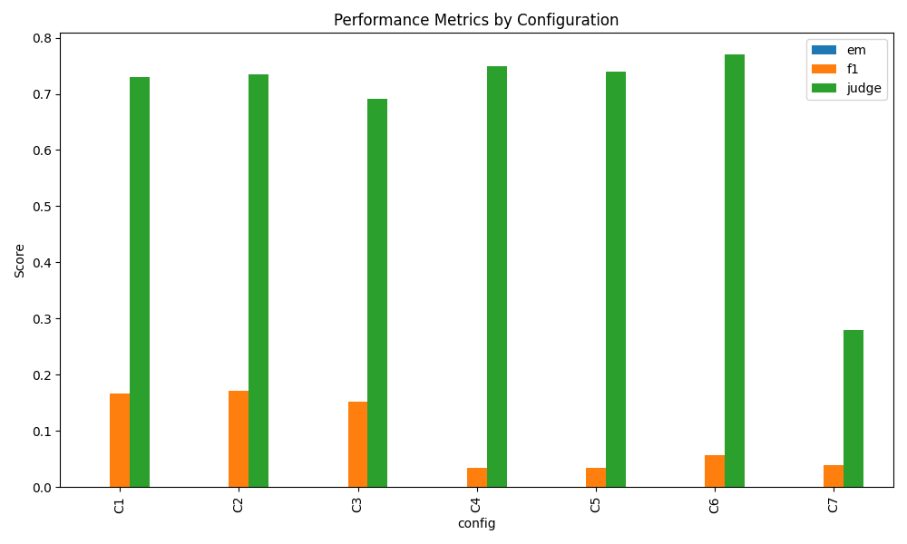

# Raport Końcowy i Wnioski z Badań (Projekt NLP)

## Cel Badania
Celem projektu była ewaluacja dużych modeli językowych (LLM), ze szczególnym uwzględnieniem modelu **Llama 3.1 8B**, w zadaniach z zakresu *Multi-hop Question Answering* na bazie zmodyfikowanego zbioru MuSiQue. Ponadto, projekt weryfikował skuteczność tradycyjnych miar n-gramowych (Exact Match, F1-Score) w porównaniu z nowoczesnym paradygmatem ewaluacyjnym **LLM-as-a-judge** obsługiwanym przez model **Gemma 2 9B**.

W tym folderze znajdują się wszystkie wygenerowane wykresy podsumowujące nasze analizy.

---

## 1. Skuteczność Miary vs "LLM-as-a-judge"

### Obserwacje:
- **Zapaść tradycyjnych miar:** Skuteczność wyrażona w metryce **Exact Match (EM)** we wszystkich scenariuszach wyniosła równe **0%**. Wynika to bezpośrednio z natury modeli generatywnych (LLM), które nawet przy podaniu prawidłowych faktów potrafią "rozlewać" odpowiedź w całe zdania. Również F1-Score oscyluje w rejonach zaledwie 3% do 17%, co nie oddaje rzeczywistej przydatności modelu.
- **Skuteczność "Sędziego":** Sędzia sztucznej inteligencji (Gemma 2 9B) ocenił sprawność modelu Llama 3.1 8B na **~69-77% poprawnych odpowiedzi** (w standardowych konfiguracjach). Sędzia potrafił wyciągnąć logiczne sedno z rozwlekłych odpowiedzi Llamy. 

### Wniosek główny:
**Tradycyjne metryki oceny tekstu są bezużyteczne przy ocenie abstrakcyjnego wnioskowania LLM-ów.** Jedynym sensownym kierunkiem ewolucji oceniania jakości modeli generatywnych jest paradygmat "LLM-as-a-judge".

---

## 2. Dystrybucja Rodzajów Błędów

Powyższy wykres kołowy obrazuje typologię błędów wychwyconych przez Sędziego w odpowiedziach, które otrzymały ocenę negatywną (Judge = 0).

### Obserwacje:
- Dominującym błędem jest **Multi-hop reasoning error (grubo ponad 80%)**. Świadczy to o tym, że dla modeli klasy 8B barierą wciąż jest wieloetapowe, łańcuchowe wyciąganie wniosków logicznych. Model często potrafi znaleźć poprawnie pierwszy fakt (tzw. "pierwszy skok"), ale nie potrafi powiązać go z "drugim skokiem".
- Pozostałe błędy obejmują m.in. **Entity Confusion** (mieszanie podobnych encji/aktorów pobocznych na podstawie kontekstu), **Format Error** (model poproszony o zwięzłą odpowiedź zaczyna generować "łańcuch myślowy") oraz sporadyczne **Hallucination** (halucynacje lub sztuczne tworzenie nienauczonych komend systemowych w odpowiedzi na brak danych).

### Wniosek główny:
Model radzi sobie dobrze z czytaniem tekstu źródłowego, ale posiada deficyty w analitycznym rozwiązywaniu łamigłówek z wymaganym dwustopniowym tokiem myślenia.

---

## 3. Błędy Systematyczne vs Stochastyczne

Ewaluacja badała również powtarzalność błędów podczas wielokrotnego generowania przy wyższej "temperaturze" modelu (generowanie z ziarnem losowości).

### Obserwacje:
- Wiele błędów ma charakter **stochastyczny** (Stochastic) - co oznacza, że Llama w niektórych przejściach przez ten sam tekst odnajdywała poprawną odpowiedź, by przy kolejnej próbie wygenerować odpowiedź kompletnie błędną.
- Część problemów była wybitnie **systematyczna** (Systematic). Kiedy model spotykał się z nietypowym sformułowaniem, notorycznie powtarzał swój błąd w 100% prób. 

### Wniosek główny:
Ustawienie odpowiedniej temperatury modelu podczas tzw. strategii *Self-Consistency* mogłoby znacząco podnieść skuteczność końcową w przyszłych architekturach wdrożeniowych.

---

## 4. Dodatkowe Wnioski (Case Study dla prezentacji)

Podczas analizy odkryto jeden z największych problemów korzystania z 9-miliardowych modeli w roli Sędziego.
- Zdarzały się rzadkie sytuacje, w których Llama 3.1 uciekała się do obszernego "lania wody", omijając faktyczny "Ground Truth". Sędzia (Gemma 2 9B), mimo iż na ogół bardzo skuteczny, dawał się "nabrać" na konstrukcję zdania o zbliżonym ułożeniu i zaliczał odpowiedź (ocena: 1).
- Zjawisko to idealnie uzasadnia ostateczną fazę projektu: **Walidację Ludzką (Cohen's Kappa)**. Pomaga nam to udowodnić prowadzącemu, że zautomatyzowane rurociągi AI mają margines błędu i nadal wymagają punktowego nadzoru człowieka w procesach produkcyjnych.
